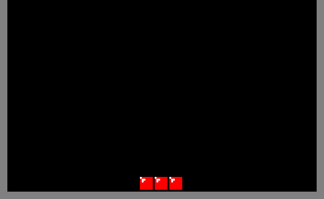
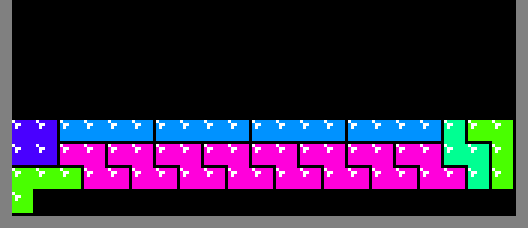
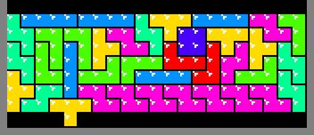
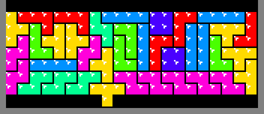
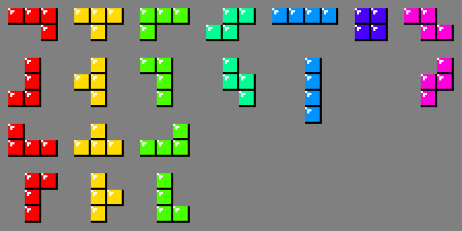
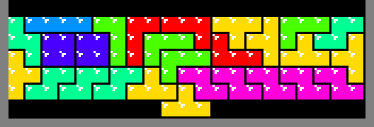

## To build:

```sh
make alt
```

To see why we recommend the alternate version instead of the original version,
see the [original code](#original-code) section.


## To use:


```sh
./birken.alt < 17_columns_wide_paint_by_numbers_file
```


### Try:

This alternate version, which we recommend that you use in order to see what is
happening with modern systems, and to not flash colours too quickly, which can
be problematic for some people, can be configured to different speeds by way of
the value used in `usleep(3)`. The default is `-DZ=13500`.

To see the program run on each text file, try:

```sh
./try.alt.sh
```

If you have perl installed it will also try a random run.

Finding the 'right' default value was a fine line; the default, 15000
microseconds (0.015 seconds), will take quite a while to finish but it allows
one to more easily see what is going on. Even easier to see would be 25000 but
these values make it quite slow and one could easily lose interest. Like some
other entries where this was made an alternate version it is configurable at
compile time. If you wish to speed it up by 100% you can instead do:


```sh
make clobber CDEFINE=-DZ=7500 alt
```

and then try `birken.alt` as above.

If you wish to speed that up 200% you can use instead `-DZ=3750`. Doing this you
might find the right value to your liking; use ctrl-c to terminate the program
early but note that the terminal is likely to be messed up. Try:


```sh
reset
```

to make it sane again (running to completion will do that for you).


## Original code:

The original code will run faster with modern systems which is likely to make it
hard to see the art of the entry but you may do so if you wish.


### Original build:


```sh
make all
```


### Original use:

Use `birken` as you would `birken.alt` above.


### Original try:

To use the demo script with the original code, try:

```sh
./try.sh
```

PLEASE be careful if you are sensitive to flashing colours!


## Judges' remarks:

This program also wins the "Most amusing abuse of the iocccsize tool" award;
although not the absolute best: it is possible to achieve 0 by writing:

```c
    /* *\
    /....
```

The game of Tetris had been used in many endeavors, from studying [algorithmic
complexity](http://arxiv.org/abs/cs/0210020) to [treating
PTSD](http://www.livescience.com/19894-tetris-treat-ptsd-flashbacks.html) and
it's even been [put on MIT's Green
Building](http://hacks.mit.edu/Hacks/by_year/2012/tetris/).
Using it for painting by numbers looks like a novel idea.


## Author's remarks:

### About This Document

This document is best viewed as an HTML file in a browser that supports animated
[GIF](https://en.wikipedia.org/wiki/GIF)s.

See the files: `*.txt`, `*.png` and `*.gif`.


### Abstract

By rotating, positioning and dropping a predetermined sequence of pieces, this
program exploits the mechanics of Tetris to generate arbitrary images.


### Algorithm Overview

The algorithm converts pixels from a source image into squares in the
[Tetris](https://en.wikipedia.org/wiki/Tetris) play-field, one row at a time
from the bottom up. To generate an individual square, the algorithm assembles a
structure consisting of a rectangular region fully supported by a single square
protruding from the bottom. When the rectangular region is completed, its rows
are cleared, leaving behind the protruding square. Three examples of the process
appear below.


During construction of a row, all of the squares produced by this method must be
supported. In the images above, the generated squares are supported by the floor
of the play-field. However, if an arbitrary row contains holes, it may not
provide the support necessary for the construction of the row above it. The
algorithm solves this problem by constructing a flat platform on top of the row
with holes. In the animation below, a platform is built above a row comprising
of a single red square. The platform is a temporary structure and inserting the
final piece removes it.


Below, a row containing 5 red squares is deposited above a row containing 3 red
squares. This is accomplished by building a flat platform on top of the lower
row. The platform provides the support necessary to generate the 5 red squares.
Finally, the platform is removed by inserting its final piece and the new row
drops into place. Note, if the algorithm needed to generate the rows in the
opposite order (a row of 3 red squares above a row of 5 red squares), a platform
would not be necessary.




### Single Square Emitters

For reference, the names of the 7
[tetriminos](https://en.wikipedia.org/wiki/Tetromino) (the game pieces or
actually a kind of geometric shape used in
[Tetris](https://en.wikipedia.org/wiki/Tetris)) appear in the table below.


This algorithm was tailored specifically to render sprites from early video
games. Those games packed graphics into 8x8 tiles where 2 bits were dedicated to
each pixel. Consequentially, sprites usually contained only 3 colors plus
transparent regions and they were typically sized either 16x16 or 16x32 pixels.

The animation below depicts all the patterns used to emit single squares. `J`,
`T` and `L` [tetriminos](https://en.wikipedia.org/wiki/Tetromino) are used
interchangeably within each pattern to produce the protruding square at the
bottom. The algorithm assigns those tetriminos to the 3 colors present in the
sprite. The remaining tetriminos are assigned arbitrary colors. And, all the
colors remain constant during gameplay.



It is not possible to emit a square of all 3 colors in the first 2 and the last
2 columns due to the shapes of the 3
[tetriminos](https://en.wikipedia.org/wiki/Tetromino). As a result, the minimal
width of a play-field to accommodate a 16 pixel wide sprite is `2 + 16 + 2 = 20`
squares. However, it turns out that 20 is too small.

As illustrated below, the region above the protruding square cannot exclusively
consist of a single row because the only pieces that could fit, the `I`
[tetriminos](https://en.wikipedia.org/wiki/Tetromino), are unsupported.


With 2 rows, the only means of spanning the full play-field width in a way that
remains supported is to use `S` and `Z`
[tetriminos](https://en.wikipedia.org/wiki/Tetromino).  But, that will always
leave holes in the upper row.


The minimal number of rows required above the protruding square is 3 and as
shown repeatedly above, such patterns do exist.  20 squares is the minimal width
required to fit a 16 pixel wide sprite.  But, `20 * 3 + 1 = 61`, which is not
evenly divisible by 4 and hence not constructible out of
[tetriminos](https://en.wikipedia.org/wiki/Tetromino).  However, a width of 21
yields `21 * 3 + 1 = 64`, which can be built with 16 tetriminos.  That width
actually enables the algorithm to render sprites up to 17 pixels wide.

The original [Tetris](https://en.wikipedia.org/wiki/Tetris) play-field is 10 x
20 squares, a 1:2 ratio.  The program maintains that ratio by using a play-field
of 21 x 42 squares.

Since `J`, `T` and `L` [tetriminos](https://en.wikipedia.org/wiki/Tetromino) are
used interchangeably to produce the emitted square and 3 squares of those
tetriminos contribute to the row above it, there are `21 - 3 + 1 = 19` single
square emitting patterns.  However, due to mirror symmetry, there are really
only 10 patterns.  Clearing 3 rows works for the majority of them.  But, an
exhaustive computer search revealed that 2 of the patterns require more.  The
next possible option is 7 rows since `21 * 7 + 1 = 148`, requiring 37
tetriminos.  As the images below show, those patterns do exist.






### Platforms

Before a row is constructed, the algorithm inspects the row below it.  If the
row below fails to provide support for all of the squares to be deposited above
it, then a temporary platform is required.  When that platform is removed, the
new row will drop, leaving some of the squares apparently floating above empty
space due to the way that gravity works in the original
[Tetris](https://en.wikipedia.org/wiki/Tetris).

The illustration below depicts the 10 platform patterns (really only 5
considering mirror symmetry).  The construction of a platform begins by dropping
a `T` [tetrimino](https://en.wikipedia.org/wiki/Tetromino) on top one of the
squares of the last generated row.  The remaining tetriminos support each other
down to that first `T`.  Meaning, as long as the previously generated row
contains at least 1 square, like the red square below, then it is possible to
construct a flat platform above it for the generation of the next row.


In the middle of platform construction, the bottom row gets completed and
cleared, leaving 3 rows above it.  The final `J` or `L`
[tetrimino](https://en.wikipedia.org/wiki/Tetromino) that will remove those rows
is not inserted until the square emitters are done generating the next row of
the sprite on top of the platform.  That final piece precludes square emission
in the first and last 2 columns.  But, as discussed above, the square emitters
are limited to the 17 inner columns due to the geometry of the `J`, `T` and `L`
tetriminos used in the process.

Also, of the 19 possible ways to start constructing a platform on top of a `T`
[tetrimino](https://en.wikipedia.org/wiki/Tetromino), only the 10 patterns shown
above exist.


### Program Input

The input sprite is represented textually.  Digit characters `0` to `7`
correspond to pixels with colors from the palette below.


As discussed above, sprites are limited to a maximum of 3 colors from this
palette.

All other characters are interpreted as transparent pixels.

The maximum permissible size of the input text is 32 rows by 17 columns. Row
length can vary as long as no single row exceeds 17 characters.

Every row must contain at least one palette digit character.

The `*.txt` files contain different sprites in this textual format that can be
fed into standard input.  Several examples take advantage of the
[Tetris](https://en.wikipedia.org/wiki/Tetris) play-field background color.
Instead of using character `0`, internal regions marked as transparent are
effectively rendered as black.


### Program Output

The program conceptually uses [Tetris](https://en.wikipedia.org/wiki/Tetris) as
an output device similar to a [line
printer](https://en.wikipedia.org/wiki/Line_printer).  It restricts itself to
those operations that can be performed on the Tetris play-field: spawning,
rotating, positioning and dropping
[tetriminos](https://en.wikipedia.org/wiki/Tetromino). This process is visually
represented using ANSI escape sequences.


### ANSImation

The rate at which the program plays
[Tetris](https://en.wikipedia.org/wiki/Tetris) is completely determined by the
rate in which the terminal application receives and displays the [ANSI
escape](https://en.wikipedia.org/wiki/ANSI_escape_code) sequences.

To slow down the output programmatically, introduce a delay immediately after the
call to `fflush(3)` (N.B: see [birken.alt.c](birken.alt.c)).


### IOCCC Size Tool Bug

This program demonstrates how to exploit a bug in IOCCC size tool version
`2013-07-30-v17`.  The first line of the program is reproduced below.

    char*_ = "'""/*";

If that line is added to the top of any program, the tool will report a size of 8.

```sh
$ ./iocccsize -i < prog.c
8
```

When that line is deleted from this program, the tool properly reports the
secondary size limit of the program as 2048.

```sh
$ ./iocccsize -i < birken.c
2048
```

Although this bug provides an easy means of circumventing contest rule 2, as
demonstrated from the size value, this entry is not necessarily striving for a
'worst abuse of the rules' award.


### Obfuscations

This program is almost, but not quite, entirely unlike a demonstration of good
programming practices. Contrary to other programs, an inspection of this one
will certainly reveal that it possesses tea, not to mention an affinity for the
constant 42.

Variables are named and ordered to spell out, `"Tetris"`, `"ELORG"`, `"DVK"` and
the aforementioned `"Tea"`.
[ELORG](https://en.wikipedia.org/wiki/Elektronorgtechnica) is the abbreviation
for `Elektronorgtechnica`, the former Soviet state owned computer organization
that handled the worldwide Tetris intellectual property rights.  DVK is the line
of Soviet PDP-11-compatible personal computers capable of running [Alexey
Pajitnov](https://en.wikipedia.org/wiki/Alexey_Pajitnov)'s original 1984
[Tetris](https://en.wikipedia.org/wiki/Tetris) prototype.

Carefully selected variable names also yielded wonderful expressions like `l=0`,
`O=0`, `O=1` and `while(O)`.  `"Tetris"` also makes a second appearance of
sorts:

```c
[T][e][t]--; while(R+i) { s
```

The source is formatted to resemble the
[Tetris](https://en.wikipedia.org/wiki/Tetris) play-field mid-game. It is also
an homage to all the [past IOCCC entries](/years.html) formatted as a compact
block of text; the `T`, orientated appropriately to reflect its name and the
first letter in the title of the game, is just a moment away from producing such
a text block.

Three tables are encoded as separate strings within the program:

The first string stores the coordinates of the squares of the 19 distinct
rotations of [tetriminos](https://en.wikipedia.org/wiki/Tetromino) (see below).
Since a tetrimino is a chain of 4 squares, all tetriminos fit within a 4x4
matrix.  To determine the coordinates of the squares, the tetrimino is pushed to
the upper-left of the matrix.  Each coordinate value requires 2 bits of storage.
Consequentially, the four x-coordinates and the four y-coordinates were packed
into separate octets.  To convert the octets into valid ASCII characters, the
squares were sorted such that the least significant bits stored the largest
coordinate values.  The results were offset by 35, the `#` character, which is 1
beyond the ASCII value of `"`, making it easier to pack into a string.  None of
the resultant values are beyond ASCII 127.  The coordinates for all 19 rotations
fit in a string of length 38.



The second string stores the single square emitter patterns and the platform
patterns.  Each pattern is a sequence of pairs, `{ tetrimino index, drop
x-coordinate }`.  As mentioned, there are 19 distinct rotations, requiring 5
bits of storage for the [tetrimino](https://en.wikipedia.org/wiki/Tetromino)
index.  Another 5 bits is required for the drop x-coordinate since there are 21
columns in the play-field.  Necessarily, the pair is stored as 2 separate
characters.  By offsetting them by 40, the `(` character, the resultant string
almost resembles a long and complex mathematical expression.  The program takes
advantage of mirror symmetry by only storing 10 single square emitter patterns
and 5 platform patterns.  The pattern lengths are not encoded within the string.
Rather, they are embedded within the string decoding logic.

The third string conceptually stores the default colors of the 19 rotations.  A
3-bit value is assigned to each, covering the 7 possible colors.  In addition,
when a mirrored pattern is executed, `J` exchanges with `L` and `S` exchanges
with `Z`, necessitating a second list of 3-bit color values.  Pairs of color
values (6 bits) fit comfortably into a character that is offset by `#`.  The
result is a string of length 19.


### Obfuscations

The program is full of subtle obfuscations:

* The unary decrement operator is used in conjunction with global variable
automatic zero initialization to set variables to `-1`.

* The boolean expression of the form, `x + 1`, is used multiple times to
determine if a value is not `-1`.  Similarly, expressions of the form `x - y`
are used to determine if `x != y`.

* Several arrays store unrelated data in segments throughout the array to reduce
named variables..

* The `x["..."]` trick appears once.

* Variable `i` is less than necessary.

* A cursorily glance at the expressions `4&&L` and `m&&e==m` suggests that they
always evaluate to true.

* The varying single square emitter pattern lengths are resolved during string
decoding using the clever expression, `(i & 3) - 3`, which identifies pattern 3
and 7 as longer.

* The file size of [birken.c](birken.c) is a prime number.  Deleting the first
line also produces a prime-sized program.  These properties do not qualify the
program as a prime number generator.


### Beyond Obfuscation

Due to the contest code size constraint, some optimizations reluctantly had to
be omitted.  For example, multi-square emitters are possible:


In fact, using dynamic programming and creative heuristics, real-time search is
possible, enabling patterns like this:



And, even this:


In addition, it is possible to extend the algorithm to 6 colors instead of just 3.
This is achieved using `I`, `S` and `Z` to produce the protruding square.  A
series of rectangular regions are constructed above those
[tetriminos](https://en.wikipedia.org/wiki/Tetromino) to erode them down to a
single emitted square.

The details of these enhancements are left as an exercise to the reader.


### Example Files

The following example files were created by the program author.  They can be
freely used and distributed.

* [format.txt](format.txt) - The layout of the program.
* [helloworld.txt](helloworld.txt) - Hello World, Tetris-style.
* [hilbert.txt](hilbert.txt) - A graphic based on the Hilbert curve.
* [ioccc.txt](ioccc.txt) - IOCCC.
* [landon.txt](landon.txt) - Portrait of a man with glasses.
* [leo.txt](leo.txt) - Portrait of a man without glasses.
* [rhino.txt](rhino.txt) - A purple rhinoceros.
* [simon.txt](simon.txt) - Portrait of a man without hair.

The following files are based on graphics from non-free, copyrighted video
games.  The use of a limited number of textual representations of the graphics
for the demonstration of this program qualifies as fair use as such files do not
significantly impede the right of the copyright holder to sell the copyrighted
material and it is not being used to generate profit in this context.  The
origin of each file is detailed below (character, game, company, year).

* [belmont.txt](belmont.txt) - [Simon
Belmont](https://en.wikipedia.org/wiki/Simon_Belmont),
[Castlevania](https://en.wikipedia.org/wiki/Castlevania_(1986_video_game)),
[Konami](https://en.wikipedia.org/wiki/Konami), 1986.

* [bloober.txt](bloober.txt) - Bloober, [Super Mario
Brothers](https://www.mariowiki.com/Super_Mario_Bros.),
[Nintendo](https://en.wikipedia.org/wiki/Nintendo), 1985.

* [bomberman.txt](bomberman.txt) -
[Bomberman](https://en.wikipedia.org/wiki/Bomberman), Bomberman,
[Hudson](https://en.wikipedia.org/wiki/Hudson_Soft), 1983.

* [boo.txt](boo.txt) - [Boo](https://www.mariowiki.com/Boo), [Super Mario
Brothers 3](https://www.mariowiki.com/Super_Mario_Bros._3), Nintendo, 1988.

* [bub.txt](bub.txt) - [Bub](https://bubblebobble.fandom.com/wiki/Bub), [Bubble
Bobble](https://en.wikipedia.org/wiki/Bubble_Bobble), Taito, 1986.

* [cheepcheep.txt](cheepcheep.txt) - [Cheep
Cheep](https://www.mariowiki.com/Cheep_Cheep), Super Mario Brothers, Nintendo,
1985.

* [gurin.txt](gurin.txt) - Gurin, [Binary
Land](https://en.wikipedia.org/wiki/Binary_Land), Hudson, 1983.

* [koopaparatroopa.txt](koopaparatroopa.txt) - [Koopa
Paratroopa](https://www.mariowiki.com/Koopa_Paratroopa), Super Mario Brothers,
Nintendo, 1985.

* [lakitu.txt](lakitu.txt) - [Lakitu](https://www.mariowiki.com/Lakitu), Super
Mario Brothers, Nintendo, 1985.

* [mario.txt](mario.txt) - [Fire Mario](https://www.mariowiki.com/Fire_Mario),
Super Mario Brothers, Nintendo, 1985.

* [mspacman.txt](mspacman.txt) - [Ms.
Pac-Man](https://pacman.fandom.com/wiki/Ms._Pac-Man) and Ghost, Ms. Pac-Man,
[Midway](https://en.wikipedia.org/wiki/Midway_Games), 1982.

* [paranaplant.txt](paranaplant.txt) - [Piranha
Plant](https://www.mariowiki.com/Piranha_Plant), Super Mario Brothers, Nintendo,
1985.

* [samus.txt](samus.txt) - [Samus
Aran](https://metroid.fandom.com/wiki/Samus_Aran),
[Metroid](https://metroid.fandom.com/wiki/Metroid_(game)), Nintendo/[Intelligent
Systems](https://en.wikipedia.org/wiki/Intelligent_Systems), 1986.

* [toad.txt](toad.txt) - [Toad](https://www.mariowiki.com/Toad), Super Mario
Brothers 2, Nintendo, 1987.

The origin of the remaining files are described below:

* [happyface.txt](happyface.txt) - Based on a
[smiley](https://en.wikipedia.org/wiki/Smiley); original trademark of smiley
[Smiley Company](https://en.wikipedia.org/wiki/The_Smiley_Company).

* [snoo.txt](snoo.txt) - 8-bit version of [Snoo](https://www.reddit.com/r/Snoo/),
[Reddit](https://www.reddit.com)'s alien mascot.


## Copyright and CC BY-SA 4.0 License:

This file is Copyright (c) 2023 by Landon Curt Noll.  All Rights Reserved.
You are free to share and adapt this file under the terms of this license:

    Creative Commons Attribution-ShareAlike 4.0 International (CC BY-SA 4.0)

For more information, see: https://creativecommons.org/licenses/by-sa/4.0/
