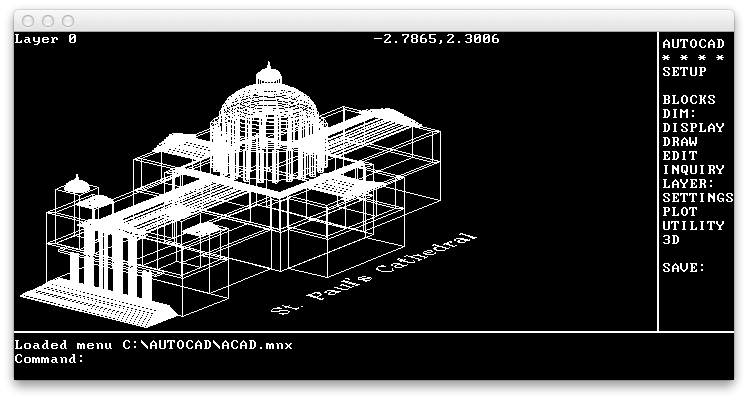
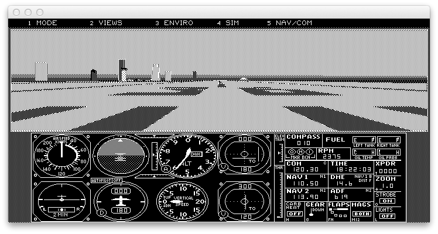
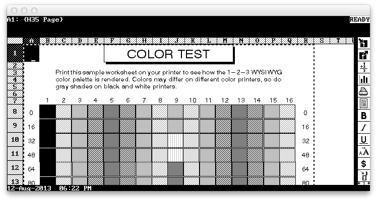
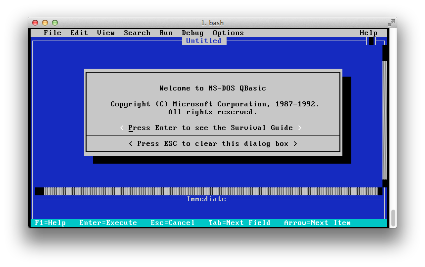
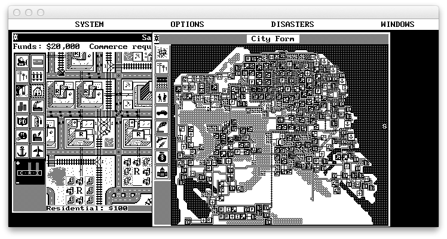
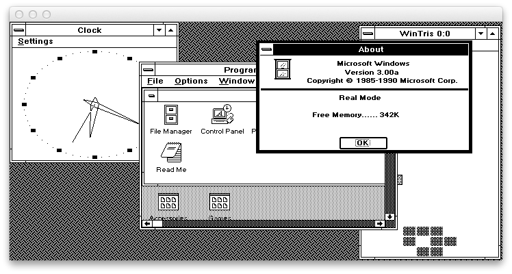

## To build:

```sh
make
```

An alternate version that should compile in Windows/MS Visual Studio is
available. See the [Alternate code](#alternate-code) section below.


## To use:

```sh
./cable3 bios-image-file floppy-image-file [harddisk-image-file]
```


### Try:

```sh
./runme
```

NOTE: to quit the program type `QUITEMU`. You might have to be at the top level
directory of the drive, `A:` or `C:`.

To send an `Alt+XXX` key combination, press (`^A` / `Ctrl+A`) then the key, so
for example to type `Alt+F`, press (`^A` / `Ctrl+A`) then `F`.

To send an `Fxx` key, press `^F` / `Ctrl+F` then a number key. For example, to
get the `F4` key, press `^F` / `Ctrl+F` then `4`. To get `F10`, press `^F` /
`Ctrl+F` then `0`.

To send a `Page Down` key, press `^F` / `Ctrl+F` then `O` (letter O, not digit
zero). To send a `Page Up` key, press `^F` / `Ctrl+F` then `E`. Other key
combinations are left for the discovery of the user.


## Alternate code:

An alternate version, which should compile in Windows, is provided. To use try:


```sh
make alt
```

Use `cable3.alt` as you would `cable3` above.


## Judges' remarks:

This entry weighs in at a magical 4043 bytes (8086 nibbles, 28,301
bits). It manages to implement most of the hardware in a 1980's era
IBM-PC using a few hundred fewer bits than the total number of
transistors used to implement the original 8086 CPU.

If you are using macOS, the included [sc-ioccc.terminal](sc-ioccc.terminal)
configuration file will correctly display console applications that use ANSI
graphics.

NOTE: the author remarked that in some systems one might need to `#include
<unistd.h>`. This has been done in the entry but not the alternate version. This
should not affect the usability of the program but will trigger a warning which
we have disabled in the Makefile.

Update: This entry now has its own website:
<https://github.com/adriancable/8086tiny>


## Author's remarks:


### A tiny but highly functional PC emulator/virtual machine

The author hereby presents, for the delectation (?) of the judges, a portable PC
emulator/VM written specifically for the IOCCC which runs DOS, Windows 3.0,
Excel, MS Flight Simulator, AutoCAD, Lotus 1-2-3 ...

In just 4043 bytes of C source, you get a complete mid-late 1980s-era
IBM-compatible PC, consisting of:

- Intel 8086/186 CPU
- 1MB RAM
- 8072A 3.5" floppy disk controller (1.44MB/720KB)
- Fixed disk controller (supports a single hard drive up to 528MB)
- Hercules graphics card with 720x348 2-color graphics (64KB video RAM), and
[CGA](https://en.wikipedia.org/wiki/Color_Graphics_Adapter)
80x25 16-color text mode support
- 8253 programmable interval timer (PIT)
- 8259 programmable interrupt controller (PIC)
- 8042 keyboard controller with 83-key XT-style keyboard
- MC146818 real-time clock
- PC speaker

The emulator uses the [SDL graphics library](https://www.libsdl.org) for
portability, and compiles for Windows, macOS, Linux and probably most other
32-bit/64-bit systems too.

If you like living on the edge you can try building the emulator on a big endian
machine, and you will get an emulation of a big endian 8086, a rather bizarre
and somewhat useless beast. For everyone else, please run the emulator on a
little endian machine.


### RULE 2 ABUSE DISCLAIMER

- [cable3.c](cable3.c) is 4043 bytes in length (half an 8086).
- `iocccsize -i < cable3.c` returns 1977 (the year the 4.77 MHz 8086 CPU was announced)
- Therefore, any suspicions the judges may have regarding rule 2 non-compliance
might be well-intentioned but are groundless.
- Nonetheless, the author would like to apologise to the judges for the
one-big-block-of-code nature of this entry, which turned out to be unavoidable.
Hopefully the joys of this entry will make up for its shortcomings.


### Why is this entry obfuscated/interesting?

- First of all the 8086 is a nightmare processor to emulate. Instruction codings
are complex and irregular in size and structure, with multiple addressing modes
and no consistent memory placement for operands, very often multiple possible
encodings for the same instruction, and the bizarre segment:offset memory model.
In addition, the 8086 has a number of bugs (e.g. PUSH SP), undocumented
behaviours and instructions (e.g. AAM/AAD + imm8, SALC, flag behaviour for
MUL/DIV, etc. etc.), and archaic features (e.g. parity/auxiliary flags) which
all need to be emulated properly. Here we emulate every feature of the CPU
pretty exactly (in fact better than most commercial clones of the processor e.g.
the NEC V30), with the exception of the trap flag which no real software uses
except for debuggers (although support for the TF can be added if deemed
important, without exceeding the IOCCC size limit).
- In addition to the CPU we also emulate all the standard PC peripheral
hardware. Parts of it are somewhat complete, much is rather dysfunctional (like
the 8253/8259) but enough to support most real software.
- Nonetheless the source, while large for the IOCCC, is rather tiny for a
functional PC emulator - around 2% of the size of the source of other
open-source 8086 PC emulators with comparable functionality.
- In fact, this entry is just like happy hour - at 4043 bytes long, you pay for
half the 8086, but you get served the whole one.
- Getting the code down to <= 4096 characters to meet the IOCCC rule 2 overall
size limit required a good deal of effort (and appreciable risk of divorce),
with obfuscation being a pretty unavoidable consequence in most places ... for
the rest, I use short circuit operators whenever possible, mix `x[y]` and `y[x]`,
don't use any flow control keywords except for `for`, use K&R-style declarations
to honor the C language's rich cultural heritage (plus it saves a byte), and
occasionally go overboard with nasty nested indexes to give things like this:
`--64[T=1[O=32[L=(X=*Y&7)&1,o=X/2&1,l]=0,t=(c=y)&7,a=c/8&7,Y]>>6,g=~-T?y:(n)y,d=BX=y,l]`.
- This entry highlights the importance of comments in C.
- This entry might result in an adjustment to the IOCCC size tool for the 2014
competition (see above).


### Compiling on different platforms

This entry has been tested on Windows (compiled with MS Visual Studio 2010 and
2013), Mac OS X (clang and gcc), and Linux (clang and gcc). The Makefile
supplied is good for Mac OS X, Linux and probably other Unices. I have received
reports that the emulator works on Raspberry Pi/Android/ARM (you will need to
compile with `-fsigned-char`) and iOS. You will need to adjust the
[Makefile](Makefile) if your system lacks `sdl-config` to correctly point to the
SDL libraries and header files.

On UNIX-based systems we can get raw keystrokes using `stty`. However Windows
has no `stty`. Therefore the Makefile includes a `-D` option to define a
"keyboard driver" `KB` which as it stands is suitable for Unices, but maybe not
non-UNIX platforms. For example, for Windows/MS Visual Studio, instead of the
Makefile definition of KB, use something slightly different - add the following
entry to the Preprocessor Definitions list in the Project Properties page:

```c
KB=(kb=H(8),kbhit())&&(r[1190]=getch(),H(7))
```

NOTE: this is done in the [Alternate code](#alternate-code).


### POSIX portability note

The code as supplied uses implicit function declarations for POSIX file I/O and
in doing so assumes that file offsets are the same bit width as your
architecture. For some systems (e.g. 32-bit Mac OS X, which uses 64-bit file
offsets) this is not the case, and to run successfully on these systems, you
will need to explicitly declare these functions by adding the appropriate
include to the top of the source:

```c
#include <unistd.h>
```

NOTE: this has been done in [cable3.c](cable3.c).

### Usage

```sh
./cable3 bios-image-file floppy-image-file [harddisk-image-file]
```

PLEASE NOTE that under Unices the keyboard must be in raw mode for the emulator
to work properly. Therefore the emulator is best run from a shell script that
looks something like:

```sh
stty cbreak raw -echo min 0
./cable3 bios floppy.img harddisk.img
stty cooked echo
```

See the [runme](runme) script.

## To use the emulator - floppy mode only

The simplest use of the emulator is with a single floppy boot disk image, like
the `fd.img` provided, which is a FreeDOS boot disk.

Before running the emulator on a Unix-type system, `stty` needs to be used to
put the keyboard into raw mode (and afterwards it needs to be put back to
cooked). So, run the emulator using something like this script (provided as
[runme](runme)):

```sh
stty cbreak raw -echo min 0
./cable3 bios fd.img
stty cooked echo
```

## To use the emulator - floppy + HD mode

Easiest to start with is to try a ready-made 40MB hard disk image containing a
whole bunch of software which is in the included file `hd.img`.

For the more adventurous, you can start off with (for example) a blank 40MB
image file called hd.img made using e.g. Makefile. Then use:

```sh
stty cbreak raw -echo min 0
./cable3 bios fd.img hd.img
stty cooked echo
```

Preparing the hard disk for use in the emulator is done just like a real PC.
Boot the emulator, and use `FDISK` to partition the hard disk. When it's done
`FDISK` will reboot the emulator. Then you can use `FORMAT C:` and you are done. The
resulting disk image is in the right format to be mounted on a real Windows PC
using e.g. `OSFMount` (Windows), `hdiutil` (macOS), or `mount` (linux/unix), providing
an easy way to copy files and programs to and from the disk image. Or, you can
install programs from regular floppy disk images (see [Floppy disk
support](#floppy-disk-support) below).


### Keyboard emulation

The emulator emulates an XT-style keyboard controlled by an Intel 8042 chip on
I/O port 0x60, generating IRQ1 and then interrupt 9 on each key press. This is
harder than it sounds because a real 8042 returns scan codes rather than the
ASCII characters which the C standard I/O functions return. Rather than make the
emulator less portable and use `ioctl(2)` or platform-dependent equivalents to obtain
real scan codes from the keyboard, the emulator BIOS does the reverse of a real
PC BIOS and converts ASCII characters to scan codes, simulating depress/release of
the modifier keys (e.g. shift) as necessary to work like a "real" keyboard. The
OS (DOS/Windows) then converts them back to ASCII characters and although this
process normally works seamlessly don't be surprised if there are issues, for
example, with non-QWERTY e.g. international keyboards.

Most of the time you can just type normally, but there are special sequences to
get `Alt+xxx` and `Fxxx`.

To send an `Alt+XXX` key combination, press (`^A` / `Ctrl+A`) then the key, so
for example to type `Alt+F`, press (`^A` / `Ctrl+A`) then `F`.

To send an `Fxx` key, press `^F` / `Ctrl+F` then a number key. For example, to
get the `F4` key, press `^F` / `Ctrl+F` then `4`. To get `F10`, press `^F` /
`Ctrl+F` then `0`.

To send a `Page Down` key, press `^F` / `Ctrl+F` then `O` (letter O, not digit
zero). To send a `Page Up` key, press `^F` / `Ctrl+F` then `E`. Other key
combinations are left for the discovery of the user.


### Text mode support

The emulator supports both text output via the standard BIOS interrupt 0x10
interface, and also direct video memory access (one page, 4KB video RAM at
segment `B800`) in `80x25 CGA 16-color` text mode.

BIOS text output calls are converted to simple writes to `stdout`. Direct video
memory accesses for the `80x25 CGA color` text mode are converted to ANSI
terminal escape sequences. If you are using a terminal which does not support
ANSI (e.g. you are compiling the emulator with `MS VC++` and running in a
Windows console window) then PC applications that directly write to video memory
in text mode might be unusable.

Most `CGA I/O` ports are not supported except for the `CGA refresh` register at
`0x3DA`, which some applications use for timing or synchronisation.

The regular PC character code page (`437`) includes various extended ASCII
characters for things like line drawing. You might want to set the font in your
terminal program to something that includes these (e.g. on Mac OS X there is a
freeware font called [Perfect DOS VGA
437](https://www.dafont.com/perfect-dos-vga-437.font) which does the trick).

Occasionally a DOS application on exit will leave the video hardware in an odd
state which confuses the emulator, resulting in subsequent text output being
invisible. If this happens, just use the DOS `CLS` command to clear the screen
and all will be well again.


### Graphics mode support

[Hercules 720x348 monochrome graphics
mode](https://en.wikipedia.org/wiki/Hercules_Graphics_Card) emulation is
implemented using SDL. Most Hercules features are supported via the normal I/O
interface on ports `0x3B8` and `0x3BA` including video memory bank switching
(segments `B000`/`B800`), which some games use for double-buffered graphics. CGA
graphics modes are not supported.

When an application enters graphics mode, the emulator will open an SDL window
(which will be closed when the application goes back to text mode). Including
code to redirect keystrokes from the SDL window to the main terminal window
would have busted the IOCCC size limits, so you need to keep the main emulator
terminal window in focus at all times even when you are doing graphics (sounds a
little odd but you will get used to it).

On Unices, SDL will automatically output graphics via X11 if the DISPLAY
environment variable is set up.


### Dual graphics card support

Some applications (e.g. AutoCAD) support a PC configuration with a CGA card and
a Hercules card, for simultaneous text and graphics output on different
displays. The emulator simulates this configuration, too, using separate windows
for the (terminal) text and (SDL) graphics displays.


### BIOS

Like a real PC, the emulator needs a BIOS to do anything useful. Here we use a
custom BIOS, written from scratch specifically for the emulator. Source code for
the BIOS (written in 8086 assembly language) which compiles with the
freely-available NASM x86 assembler is in [bios.asm](bios.asm).

The BIOS implements the standard interrupt interfaces for video, disk, timer,
clock and so on, much as a "real" PC BIOS does, and also a small
timer-controlled video driver to convert video memory formatting into ANSI
escape sequences when the emulator is in text mode.


### CPU and memory emulation

Memory map is largely as per a real PC, with interrupt vector table at `0:0`,
BIOS data area including keyboard buffer at `40:0`, CGA text video memory at
`B800:0`, Hercules dual-bank graphics memory at `B000`/`B800:0`, and BIOS at
`F000:100`. Unlike a real PC, in the emulator the CPU registers are
memory-mapped (at `F000:0`), which enables considerable optimisation of the
emulator's instruction execution unit by permitting the unification of memory
and register operations, while remaining invisible to the running software.

The CPU supports the full 8086/186 instruction set. Due to the complexities of
the 8086's arbitrary-length instruction decoding and flags, 8086 instructions
are first converted to a simpler intermediate format before being executed. This
conversion, along with instruction lengths and how each instruction modifies the
flags, is assisted by some lookup tables which form part of the BIOS binary.

The CPU also implements some "special" two-byte opcodes to help the emulator
talk with the outside world. These are:


- `0F 00` - output character in register `AL` to terminal.
- `0F 01` - write real-time clock data (as returned by `localtime()`) to memory
location `ES:BX`.
- `0F 02` - read `AX` bytes from disk at offset `512*(16*SI+BP)` into memory
location `ES:BX`. Disk is specified in `DL` (`0` = hard disk, `1` = floppy
disk).
- `0F 03` - write `AX` bytes at memory location `ES:BX` to disk at offset
`512*(16*SI+BP)`. Disk is specified in `DL` as per `0F 02`.

Emulator exit is triggered if `CS:IP == 0:0` (which would be nonsensical in real
software since this is where the interrupt vector table lives). The supplied
`fd.img` disk includes a small program `QUITEMU.COM` which contains a single
`JMP 0:0` instruction, to allow the user to easily quit the emulator without
shutting down the terminal.


### Floppy disk support

Emulates a 3.5" high-density floppy drive. Can read, write and format 1.44MB
disks (18 sectors per track, 2 heads) and 720KB disks (9 sectors per track, 2
heads).

If you want to install your own software from floppy images (downloaded from
e.g. [Vetusware](https://vetusware.com)), the easiest way to "change disks" is
to copy each disk image in turn over the floppy image file you specify on the
command line. Don't forget to put your original boot disk back at the end!


### Hard disk support

Supports up to 1023 cylinders, 63 sectors per track, 63 heads for disks up to
528MB.

Disk image format used is a subset of the standard "raw" format used by most
disk image mount tools. In general, disk images prepared by the emulator will
work with disk image tools and other emulators, but not the other way around.

The emulator uses a particularly dumb algorithm to derive a simulated
cylinder/sector/head geometry from the disk image file's size. This algorithm
often results in not all the space in the image file being available for disk
partitions. For example, creating a 40,000,000 byte image file results in `DOS
FDISK` seeing only 31.9MB as the volume size.

Note that unlike a real PC, the emulator cannot boot from a hard disk (image).
Therefore, you will always need to use a bootable floppy image, even if after
boot everything runs from the HD.


### Mouse

No mouse is emulated.


### Real-time clock

Reading the [RTC](https://en.wikipedia.org/wiki/Real-time_clock) (both time and
date) is emulated via the standard BIOS clock interface, pulling the time/date
from the host computer. Setting the time or date is not supported.


### Timers

A countdown timer on I/O port `0x40` is simulated in a broken way which is good
enough for most software. On a real PC this has a default period of 55ms and is
programmable. No programmability is supported in the emulator and the period may
be about right or completely wrong depending on the actual speed of your
computer.

On a real PC, IRQ 0 and interrupt 8 are fired every 55ms. The emulator tries to
do the same but again, the delay period is not calibrated so you get what you
get.


### PC speaker

Beeps only, through the console.


### Software supported

The emulator will run practically any software a real PC (of the spec listed at
the top of this file) can. The author has tested a number of OSes/GUIs (MS-DOS
6.22, FreeDOS 0.82pl3, Windows 3.0, DESQview 2.8), professional software (Lotus
1-2-3 2.4 and AsEasyAs 5.7 for DOS, Excel 2.1 for Windows, AutoCAD 2.5, WordStar
4), programming languages (QBASIC, GWBASIC, Turbo C++), games (Carrier Command,
Police Quest, and a bunch of freeware Windows games), and diagnostic/benchmark
software (Manifest, Microsoft MSD, InfoSpot, CheckIt) and all of them run well.

Screenshots of some of these applications running (on Mac OS X) are provided for
the impatient.














### Compiler warnings

A lot of compiler warnings are produced by clang. Missing type specifiers,
control reaching the end of functions without returning values, incompatible
pointer type assignments, and some precedence warnings, all necessary to keep
the source size down. Other compilers are likely to produce similar warnings.


## Copyright and CC BY-SA 4.0 License:

This file is Copyright (c) 2023 by Landon Curt Noll.  All Rights Reserved.
You are free to share and adapt this file under the terms of this license:

    Creative Commons Attribution-ShareAlike 4.0 International (CC BY-SA 4.0)

For more information, see: https://creativecommons.org/licenses/by-sa/4.0/
