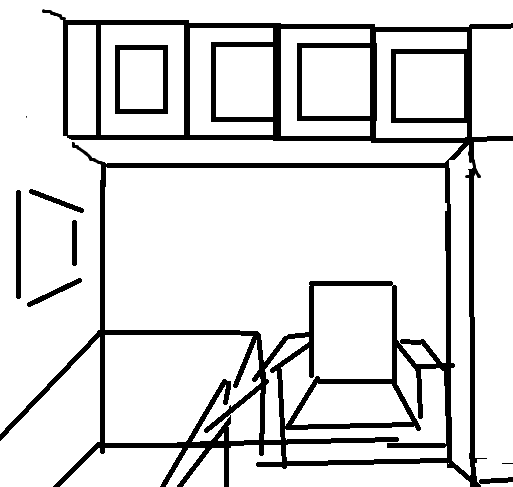
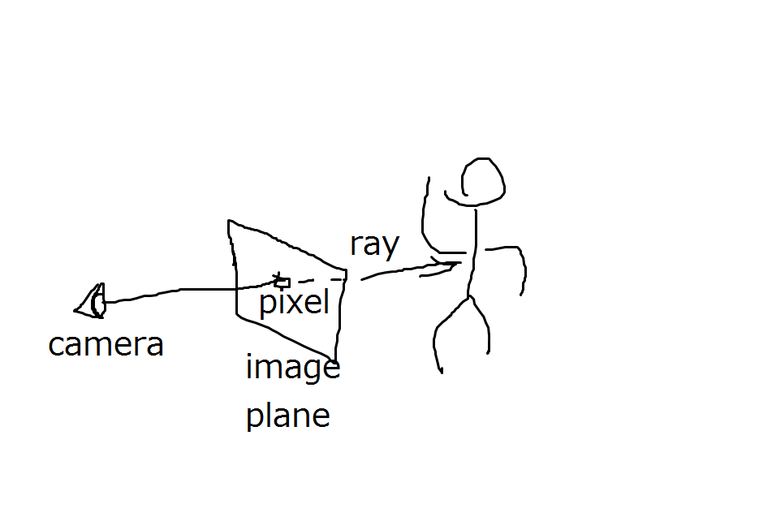
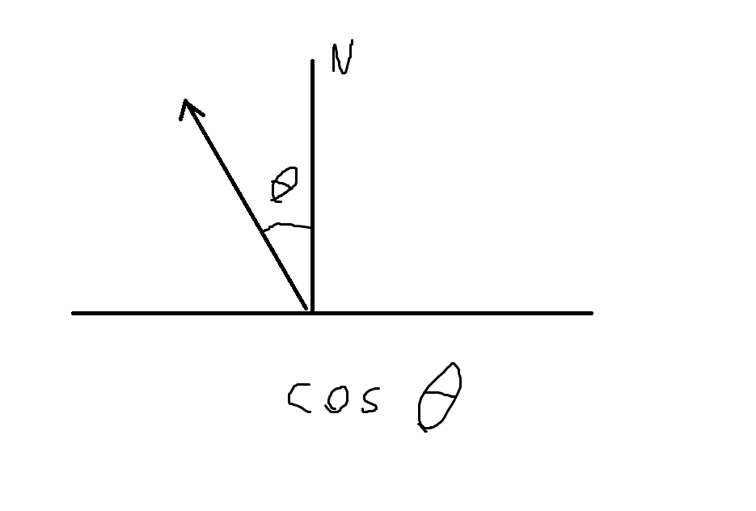


# Scene format documentation

This file is encoded in UTF-8 as the BOF marker indicates.

You can directly feed it to the renderer. If you're wondering about what the following code block does, that's why:)

	@|?|?z#
	@|||?z&
	>?Sedvf
	??Tdeu#
	>>Tdeui
	??Tdmmf
	??[[euf
	?}?Oq}e
	?}?Oqqf
	v}?|q}e
	v}?|qqf
	?Sj|?{f
	?Tjk?{e
	FF?Oqq$
	RR?Oqq$
	^^?Oqq$
	jj?Oqq$
	vv?|qq$
	IOBMqqe
	U]BMqqe
	aiBMqqe
	muBMqqe
	EEEJpp%
	QQEJpp%
	]]EJpp%
	iiEJpp%
	uuEJpp%
	ZnY|{|e
	[mZ|\{\{#
	[mZ|||f
	kkdr\{\{\%
	lkdr\{\{>

## Basic structure

A scene file begins with arbitrary binary data, followed by several shader functions.

Shader functions are declared using a one-character name followed by a ']' character. There are some special function names, which will be explained below.

The language used to write shader functions is very simple. Basically, you write a sequence of assignment statements like this:
	A=A+D
	B=B+E
Namely, you write a one-character variable name, an equal sign '=', followed by an expression (made of operators and one-character variable names, of course).

## Expressions

The shader language supports seven operators, listed highest priority first:
	*/+-<#:

`*/+-<` mean what they mean in C, but the priority part is a bit different. Basically, `*` has higher priority than `/`, so `A/4*4` actually computes `A/(4*4)`. And you can't write `(A/4)*4` -- brackets are not supported. As an advice, keep your expressions simple :) If you really needs to write something like C=(A/4)*4, write instead:
	B=A/4+
	C=B*4

The # operator acts somewhat like the C ?:. It returns one of its two operands based on, what else, the value of variable #. When # is true, # returns its second operand.

The : operator calls built-in functions. The first operand is the function id and the second is the parameter. Here is a list of functions:
	0:x = the x-th byte of the scene file
	1:x = sin(x*PI)
	2:x = atan2(x,#)/PI
	3:x = sqrt(max(x,0))
	4:x = floor(x)
	5:x = the next number in the (allegedly random) number sequence, can't be called in volume shaders
	6:x = value of the variable (char)(120+x)
	7:x = write #'s value to the variable (char)(120+x)

Contrary to popular belief, the language itself doesn't support numerical constants. Any character sitting between operators is a variable. When you see 1/2, it's in fact dividing the variable 1's value by the variable 2's value. For everyone's convenience, though, in the beginning every variable is initialized to its ASCII code minus 48. As long as you don't write something like 3=1+1, you can use single digit numbers as, well, single digit numbers. If you need something like 1920 or 0.73, you need to compute it yourself. And yes, all variables store floating point values.

If a character appears as the first character of any argv, it goes to zero. This includes the scene filename. If you name your scene '1.scene', well, good luck with 1=0!

You can terminate a statement using any character that isn't an operator, be it \n or ;. But you must put in one and only one character. Put in two (e.g. the Windows \r\n), and it terminates your function. Also, the first statement must begin immediately after ']'.

When a function terminates, the interpreter calls the next function specified by variable R. If you want to call function 'n', just write somewhere:
	R=n
providing you have left n at its initial value. If you want to actually return to the renderer, put in R=0.

As you may have noticed, you can put in all kinds of stuff between functions, like this comment.

## How the ____ do I render an image with shaders?

Basically, you define a geometry using volume shaders, define a camera using a camera shader, and define light sources and surface reflectance properties using material shaders.

-------------------------------------------
Continue to the comments before function A
-------------------------------------------

	//As an (optional) assignment, figure out what function `n` does. And why there is a plus sign at every EOL except the last.
	n]#=1+
	x=X+1/2+
	d=0:U;d=d-n;U=U+1;A=d<x;#=#*A+
	d=0:U;d=d-n;U=U+1;A=x<d+1;#=#*A+
	x=Y+1/2+
	d=0:U;d=d-n;U=U+1;A=d<x;#=#*A+
	d=0:U;d=d-n;U=U+1;A=x<d+1;#=#*A+
	x=Z+1/2+
	d=0:U;d=d-n;U=U+1;A=d<x;#=#*A+
	d=0:U;d=d-n;U=U+1;A=x<d+1;#=#*A+
	d=0:U;d=d-n;U=U+1+
	U=U+2+
	C=C#d+3*9+
	#=d+
	R=0#n

-------------------------------------------

The function "A" initializes global settings:
	G -- Image width, in pixels
	H -- Image height, in pixels
	I -- Perturbation probability
	J -- Camera ray stratification probability
If you have used a MLT renderer before, you probably know what I and J does. If you don't, well, use the same value as the default scene. Everything converges just fine under suboptimal settings, just a little slower. Generally, use a higher value for I if your scene is primarily illuminated by some indirect source.

"A" also serves as the geometry shader for volume 0. The scene geometry is made of up to 32 volumes, each with 64x64x64 cells. The volume 0 is the 'top level' volume where the camera goes. Each cell of a volume can be empty, filled with a material, or another volume. The round-ish characters in old_default.scene and the carpet on the floor in this file are examples where a cell is defined to another volume. Materials will be explained later.

The volume shader for the i-th volume is named as the (i+1)-th capital letter. Each volume shader is invoked once for each cell. The cell coordinates (0..63) are given as inputs in variable x,y,z, and you're supposed to return the cell content in variable C. To fill it with material i, return 64+i in C. To fill it with volume i, well, return i. To leave it empty, return C=0.

Before starting to build a scene, it's better to have a draft sketch handy first. Something like . Sometimes it's hard to imagine where something should go without the sketch. And you don't have to stick to your sketch :)

What motivated my default scene: it was the full moon's day (a national holiday) in China and my parents were planning to renovate their apartment. I rendered the image to tell my mom how ridiculous her starry-sky wall paper would look like if she used it on every single wall. She ends up using it on just one wall, the one facing my bed, to thank me for the effort.

-------------------------------------------
Continue to the comments before function a
-------------------------------------------

	//As a bonus, find out what the first line does
	A]#=#-#;"=7:0-p+^;#="+
	R=n+
	G=p*:+
	#=0<B+
	G=G*2#G+
	H=G*3/4+
	I=4/5+
	J=1/2+
	C=p+1+
	U=w+w+w

-------------------------------------------

The function 'a' is the camera shader, which, well, generates the camera ray. It's supposed to return the ray in variables UVWXYZ and ABCDEF (that may sound like a lot of variables, but it really isn't that much).

Here comes some subtlety of PSSMLT (Primary Sample Space Metropolis Light Transport, or Kelemen-style MLT). Basically, a PSSMLT renderer gives you an (allegedly random) number sequence, and you compute a color out of it. This is usually done by generating and tracing rays out of those random numbers. The renderer would assemble the colors into an image.

Remember the function 5? Here it comes. The first two "random" numbers have special meaning and must specify a point on the image plane [0,1)x[0,1). You're supposed to transform the image plane to the 3D space, choose a point for the camera, and shoot a ray from the camera point to the image plane point, see . The camera point goes to (U,V,W), and the ray direction vector (image plane point - camera point) is (X,Y,Z). For the coordinate space, volume 0 is scaled up 64x here to (0,0,0)-(4096,4096,4096).

For a basic camera shader example, check "otherroom.scene".

If any ray goes out of volume 0, the renderer crashes. Make sure it doesn't happen. Wall up everything.

Variables ABCDEF control the color returned from the ray. They will be explained in the material shaders part. For now, just put in:
	A=0;B=0;C=0
	D=1;E=1;F=1

-------------------------------------------
Continue to the comments before function 1
-------------------------------------------

	a]R=0+
	X=5:5+
	Y=5:5+
	X=X-1/2+
	Y=Y-1/2+
	x=5:5+
	y=5:5+
	x=x-1/2+
	y=y-1/2+
	x=x*8*7;y=y*8*7+
	X=X*G+
	Y=Y*H+
	Z=H*2/3+
	d=4*;+
	d=d*p/Z+
	X=x+X*d+
	Y=y+Y*d+
	Z=Z*d+
	U=p*p/2-p*2+x+
	V=p*p/2+p*1-y+
	W=p*8+
	A=0;B=0;C=0+
	D=1;E=1;F=1

--------------------------------------------------------

The numbered functions define materials, i.e., surface reflectance properties. As the name suggests, the shader simulates ray-surface interaction. It's done by updating UVWXYZABCDEF, of course.

ABCDEF define colors. (A,B,C) is the RGB irradiance ultimately returned to the renderer, and (D,E,F) maintains the cumulative RGB reflectance of the current ray path. This may sound confusing, but basically, if the surface is a light source, you accumulate the current path reflectance (D,E,F), multiplied by the light strength, to (A,B,C). See shader 6 for an example.

If you want a colored surface, use its color to modulate (D,E,F), i.e. D=D*red;E=E*green;F=F*blue, easy as that. To get some texturing, compute the color procedurally or look up a binary table.

There's something subtle about colors. To go along with the trend, the renderer follows the practice of linear rendering with a gamma of 2. Stripping the fancy jargons, that basically means after picking a color in your favorite image editing program, you need to convert the RGB values from 0..255 to 0..1, and then put here its *square*. Only after squaring you get your real, lively color in the output image, as opposed to something dull and gray. You need to do the same if you use a RGB texture. And yes, that is the what the second sqrt in a.c is for.

Going beyond colors, to define a shiny or dull surface one needs more maths, and optics. The jargon for this is BRDF (Bidirectional Reflectance Distribution Function) importance sampling. Let's continue to function o.

-------------------------------------------
Continue to the comments before function o
-------------------------------------------

	//This function computes the starred wallpaper
	//Original color: 0.36 0.714285 0.8
	1]R=o+
	d=p*6+
	x=U+W+
	x=4:x/d+
	z=4:V/d+
	#=3*x-4*z+
	y=4:#/5+
	#=#-y*5+
	y=1#0+
	x=x*d+d/2-U+W+
	z=z*d+d/2-V+
	r=3:x*x+z*z+
	#=z+
	u=2:x+
	d=1:u*5+
	d=d*d*d+3/2+
	d=d*p+
	#=r<d+
	#=#*y+
	d=2/5#I+
	D=D*d+
	E=E*4/7+
	d=I#2/5+
	F=F*d

-------------------------------------------

Function o defines a diffuse (that is, dull) surface. To define reflectance properties like this, one needs to sample an outgoing ray direction, based on the incoming direction and the surface normal. It's called importance sampling, because here the probability of each outgoing direction has to be proportional to the reflected light strength (i.e., the BRDF) on that direction. For a diffuse surface, sample the upper hemisphere with a probability proportional to the cosine of the outgoing angle, see .

The incoming direction is in (X,Y,Z) and the hit point is (U,V,W). The outgoing direction is returned in, where else, (X,Y,Z).

The surface normal is provided in variables S and T. Since the geometry is defined as a bunch of cube-shaped cells, there are only 6 possible normals: (±1,0,0) (0,±1,0) (0,0,±1). Here S is the sign and T is the dimension. If you get S=-1 and T=1, the normal is (0,-1,0).

If you don't want to redo all the math yourself... this file provides a few simple shader functions:
	o -- Diffuse surface. Do the color thing your self and call R=o
	5 -- Perfect mirror.
	f -- Surface with a Fresnel term. Basically, it resembles a polished surface made from a dielectric material.

For something more complex like a fluffy carpet, well, you could use a volume to directly model the mesoscopic detail. Shader D in this file produces a bunch of dense, tiny spikes to simulate a fluffy appearance.

-------------------------------------------
Continue to the EOF
-------------------------------------------

	//diffuse ray generation
	o]R=0+
	u=5:5+
	v=5:5+
	v=v*2+
	r=3:u+
	z=1:v+
	y=1:1/2+v+
	z=z*r+
	y=y*r+
	x=3:1-u+
	x=0-x*S+
	X=6:T+
	w=x;x=z;z=y;y=w+
	Y=6:T+
	w=x;x=z;z=y;y=w+
	Z=6:T

	//reflector
	5]R=0+
	x=1;y=1;z=1+
	#=0-1+
	#=7:T+
	X=x*X;Y=y*Y;Z=z*Z
	
	//approximate Fresnel, works better than the real thing when you don't want to tweak the IOR
	f]x=X;y=Y;z=Z+
	r=3:x*x+z*z+y*y+
	d=6:T+
	d=1-d*S/r+
	d=d*d*d+
	#=5:5+
	#=d<#+
	R=5#o+
	d=d#1-d+
	u=1#u+
	v=1#v+
	w=1#w+
	D=D*d*u+
	E=E*d*v+
	F=F*d*w
	
	//the handles
	B]R=0+
	#=X<8*3+
	C=3#0
	
	C]R=0+
	#=X<8*4+
	C=0#4
	
	//red-Fresnel
	2]R=f+
	u=1/2;v=1/9;w=v
	
	//white-Fresnel and the full moon
	3]R=f+
	u=7*9/p;v=u;w=v+
	x=3*:+8+
	z=U-x*p+p/2+
	x=V-x*p-p/2+
	r=3:x*x+z*z+
	#=4<r/p+
	D=D*I#D+
	E=E*4/7#E+
	F=F*2/5#F+
	d=1/5#0+
	A=A+D*d+
	B=B+E*d+
	C=C+F*d
	
	//handle
	4]R=5+
	D=D*I;E=E*4/7;F=F*2/5
	
	//light from the window
	6]R=0+
	#=P+
	d=2#8*2+
	A=A+D*d+
	B=B+E*d+
	C=C+F*d*I+
	P=9
	
	//carpet
	7]R=o+
	D=D/7+
	E=E/3+
	F=F/7
	
	D]R=0+
	#=8<Y+
	C=0#3+
	#=4:3*X-4*Z+
	y=4:#/7+
	#=#-y*7+
	C=7#C

-------------------------------------------

The last line, well, is the output filename. Just remember to throw in two ']'s and don't put a newline after it.

	]]example.ppm
